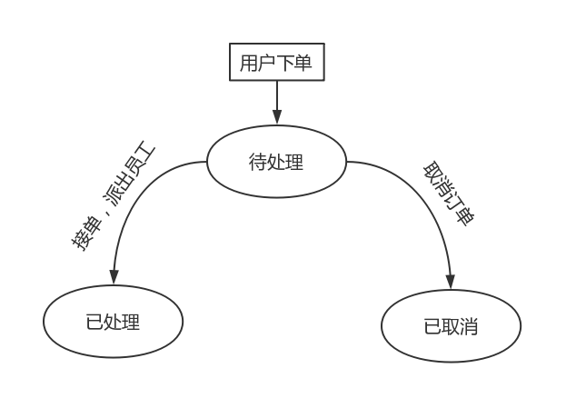
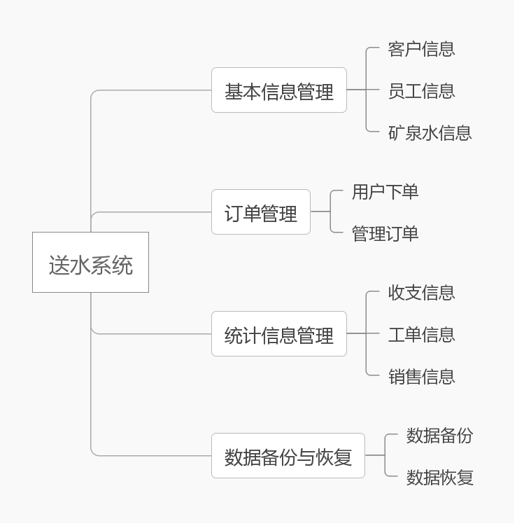
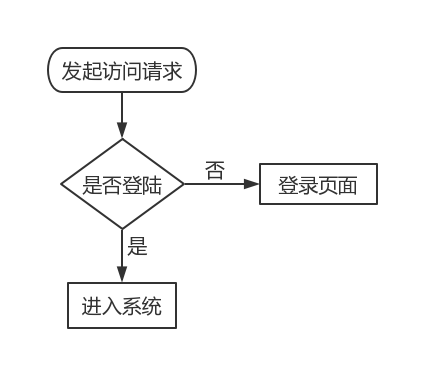
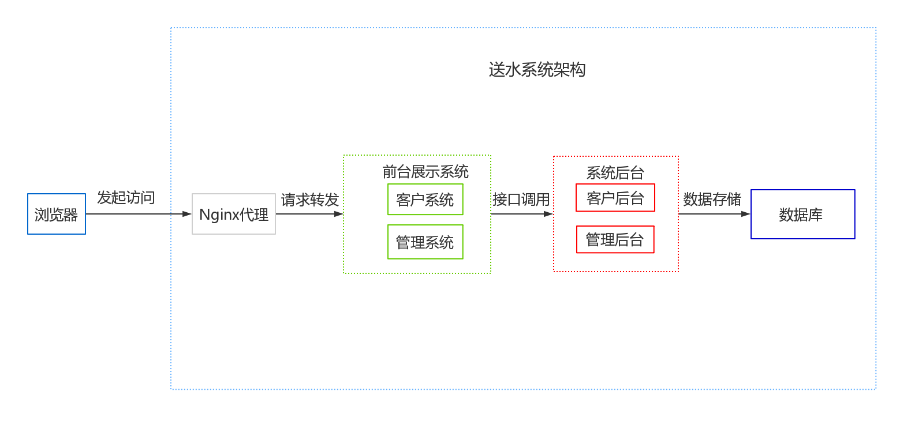
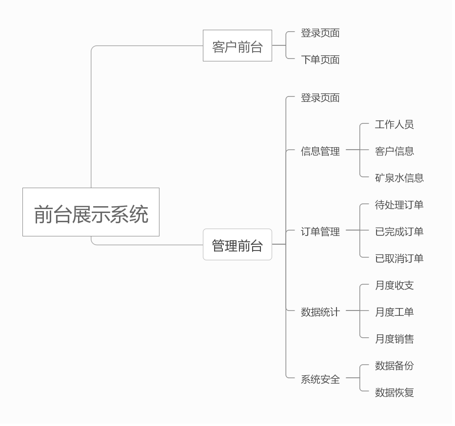
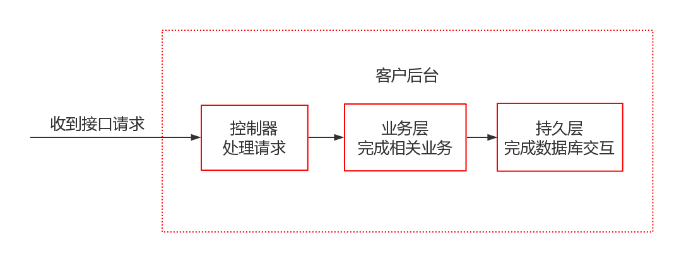

[TOC]

# 一、系统开发概述

## 1.1 开发背景

随着经济不断发展，城市的不断扩张，城市居民的用水需求量也在不断的攀高。为了适应人们的消费需求，近年来我国的饮用水市场发展极快，据不完全统计，目前全国各类饮用水生产厂家有2000多个。各地类似“送水公司”这样的服务业也随之不断发展。各企业竞争激烈，提高公司员工工作效率和服务质量是制胜的重要因素，另一方面在于与客户的沟通和公司自我形象的不断完善。

现今的社会，计算机已经成为人们处理日常事务不可缺少的一种工具，他能够把事情的复杂化转为简单化，使流程更加顺畅方便。对于大多数的中小型送水服务公司来说，产品、价格及质量都逐渐趋同。一个专门针对送水行业的软件，就能成为同行竞争中有利的优势。

# 二、系统规划

## 2.1 系统目的

本课程设计实验报告主要设计对象是矿泉水公司的送水系统。矿泉水以其富含的矿物质和低廉的价格，被大家广泛的使用。消耗量很大，需要专门的人员派送。

但是以往的电话定水在用水旺季难免会被漏接，导致送水缓慢，容易造成客户流失，而且有时候由于送水时间被拖延，水送到家里时户主不在，严重导致送水效率低。我的课程设计目就是为了做一个送水的系统解决以上问题，提高公司竞争力。

## 2.2 系统组成部分

本管理系统以数据库系统为核心展开，采用BS架构向用户提供服务，即系统服务后台和界面展示前台。

因此，系统的开发有三个部分：

- 数据库系统
- 后台服务系统
- 前台展示系统

## 2.3 系统技术选型

数据库：MySQL 5.6

系统后台：Spring + SpringMVC + Mybatis

展示前台：Vue2 + Bootstrap4

# 三、需求分析

## 3.1 数据需求

### 3.1.1 基本信息

本系统的运行需要以下基本数据的支持：

- 员工（姓名、工号、工资、联系方式等）
- 客户（姓名、地址、联系方式等）
- 供应商（名称、地址、联系方式等）
- 矿泉水（名称、规格、成本价、零售价）
- 仓库（名称、地点）

### 3.1.2 记录型信息

除了基本信息以外，还需要以下数据：

- 订单（订单号、客户、矿泉水、数量、下单时间、订单状态）
- 工单（工单号、客户、矿泉水、数量、接单时间、接单员工）
- 库存（矿泉水编号、数量）
- 供货详情（矿泉水编号、供货商号）

### 3.1.3 统计型信息


对以上数据进行统计：

- 月度开支、销售与盈利
- 月度工单数据
- 月度客户订单数据

## 3.2 功能需求

### 3.2.1 基本信息管理

本系统应该能够对基本信息进行管理，包括增加、删除、修改和查询。

并且针对以上信息要向管理员分别提供单独的管理页面，允许系统管理员对五类的基本信息进行可视化管理。

以下为应用场景：

#### 3.2.1.1 客户信息

场景目标：通过系统可以实现录入客户的基本信息，查看用户的基本信息。

操作流程：

1. 管理员登录管理系统
2. 点击`客户信息`按钮
3. 浏览客户的基本信息
4. 在`客户信息管理`页面，输入客户信息，点击`添加顾客`按钮，录入客户信息。
5. 在`客户信息管理`页面，点击`删除客户`按钮，直接删除客户

#### 3.2.1.2 员工信息

场景目标：通过系统可以实现查看员工、录入员工、修改员工基本工资、删除员工

操作流程：

1. 管理员登录管理系统
2. 点击`工作人员`按钮
3. 浏览工作人员基本信息
4. 在`工作人员信息管理`页面，输入工作人员信息，点击`添加员工`按钮，录入工作人员信息
5. 在`工作人员信息管理`页面，点击`修改员工工资`按钮，输入新的基本工资，点击`确定`按钮以修改，点击`取消`按钮以取消
6. 在`工作人员信息管理`页面，点击`删除员工`按钮，直接删除工作人员

#### 3.2.1.3 矿泉水信息

场景目标：通过系统可以实现查看矿泉水列表、添加矿泉水、为矿泉水添加供应商、从供应商购买矿泉水（进货）

操作流程：

1. 管理员登录管理系统
2. 点击`矿泉水信息`按钮
3. 浏览矿泉水基本信息
4. 在`矿泉水信息管理`页面，输入矿泉水信息，点击`添加矿泉水`按钮，添加矿泉水
5. 在`矿泉水信息管理`页面，点击`进货`按钮，选择`供应商`和`员工`，输入进货`数量`，点击`进货`按钮以完成进货，点击`取消`按钮以取消
6. 在`矿泉水信息管理`页面，点击`添加供应商`按钮，选择`供应商`，点击`添加`按钮以完成，点击`取消`按钮以取消
7. 在`矿泉水信息管理`页面，点击`删除矿泉水`按钮，直接删除矿泉水

### 3.2.2 订单管理

`订单`是最核心的要素，本系统的主要功能都以`订单`为中心展开。`订单`有三种状态，分别是`待处理`、`已处理`、`已取消`。

当客户登录`客户系统`购买矿泉水时，系统会创建一个`订单`，订单信息包含客户信息、矿泉水种类、矿泉水数量、下单时间等。

对于刚创建的`订单`，其默认的状态为`待处理`，管理员能够指派员工接单并从仓库中取货，此时订单将变为`已处理`状态；对于`待处理`状态的订单，管理员还可以对其进行取消订单的操作，此时订单会进入`已取消`状态。

这三种状态之间的转移图示如下：



#### 3.2.2.1 用户下单

场景目标：客户通过系统可以购买矿泉水

操作流程：

1. 客户登录客户系统
2. 浏览矿泉水列表
3. 点击`购买`按钮
4. 输入购买数量
5. 点击`下单`按钮即可完成购买，点击`取消`按钮即可取消购买

#### 3.2.2.2 管理订单

场景目标：管理员通过系统可以对订单进行处理和取消

操作流程：

1. 管理员登录管理系统
2. 点击`订单管理按钮`
3. 选择`待处理`、`已处理`、`已取消`的订单
4. 浏览相应状态的订单
5. 在`待处理订单页面`，点击`接单送货`按钮，选择`员工`，点击确定以处理订单，点击`取消`以取消处理过程
6. 在`待处理订单页面`，点击`取消订单`按钮，直接取消订单

### 3.2.3 统计信息管理

#### 3.2.3.1 月度收支信息

场景目标：管理员可以通过系统查看每个月的收支记录，包括年月信息、当月总销售额、当月总进货额、当月总工资、当月总利润

操作流程：

1. 管理员登录管理系统
2. 点击`月度收支`按钮
3. 浏览收支信息

#### 3.2.3.2 月度工单信息

场景目标：管理员可以通过系统查看每个月各个员工的工作（送水）记录，并且按送水量排序

操作流程：

1. 管理员登录管理系统
2. 点击`月度工单`按钮
3. 浏览全部月份的工单信息
4. 输入年月信息，点击`查询工单`按钮
5. 浏览指定月份的工单信息

#### 3.2.3.3 月度销售信息

场景目标：管理员可以通过系统查看每个月各个顾客的购买记录，并且按购水量排序

操作流程：

1. 管理员登录管理系统
2. 点击`月度销售`按钮
3. 浏览全部月份的销售信息
4. 输入年月信息，点击`查询销售`按钮
5. 浏览指定月份的销售信息

### 3.2.4 数据备份与恢复

#### 3.2.4.1 数据备份

场景目标：管理员可以通过系统导出系统中的所有数据，从而达到备份的效果

操作流程：

1. 管理员登录管理系统
2. 点击`数据备份`按钮
3. 在`数据备份`页面，点击`下载`按钮
4. 完成数据备份

#### 3.2.4.2 数据恢复

场景目标：管理员可以通过系统导入之前备份的数据，从而达到数据恢复的效果

操作流程：

1. 管理员登录管理系统
2. 点击`数据恢复`按钮
3. 在`数据恢复`页面，点击`选择文件`按钮
4. 在`数据恢复`页面，点击`上传`按钮
5. 完成数据恢复 



# 四、数据库逻辑设计

## 4.1 E-R 图


## 4.2 数据项

| 数据项      | 类型  | 长度 | 备注                                                         |
| ----------- | ----- | ---- | ------------------------------------------------------------ |
| 客户编号    | INT   | -    | 自动递增，不能为 Null                                        |
| 联系人姓名  | VCHAR | 30   | 不能为 Null，联系人姓名可以重复                              |
| 客户地址    | VCHAR | 200  | -                                                            |
| 联系电话    | VCHAR | 11   | -                                                            |
| 订单号      | INT   | -    | 自动递增，订单号是唯一的                                     |
| 处理时间    | TIME  | -    | 不能为 Null                                                  |
| 矿泉水编号  | INT   | -    | 自动递增，编号唯一                                           |
| 数量        | INT   | -    | 不能为 Null，正数为增加，负数为减少                          |
| 工号        | INT   | -    | 自动递增，工号唯一                                           |
| 姓名        | VCHAR | 30   | 不能为 Null，姓名可以重复                                    |
| 性别        | INT   | -    | 只能取 “0” 或 "1" ，“0” 为 “男”， “1” 为 女                  |
| 入职年份    | TIME  | -    | 不能为 Null                                                  |
| 基本工资    | INT   | -    | 大于 0 ，单位为 “分”                                         |
| 出生日期    | TIME  | -    | -                                                            |
| 仓库名      | VCHAR | 30   | 不能为 Null                                                  |
| 仓库编号    | INT   | -    | 自动递增，编号唯一                                           |
| 仓库地址    | VCHAR | 200  | -                                                            |
| 出/入库时间 | TIME  | -    | 不能为 Null，当数量为正数时，表示入库时间，当数量为负数时，表示出库时间 |
| 供应商编号  | INT   | -    | 自动递增，编号唯一                                           |
| 供应商名称  | VCHAR | 30   | 不能为 Null，可重复                                          |
| 供应商地址  | VCHAR | 200  | -                                                            |
| 矿泉水名称  | VCHAR | 30   | 不能为 Null                                                  |
| 矿泉水规格  | INT   | -    | 单位为 mL                                                    |
| 矿泉水成本  | INT   | -    | 大于 0 ，单位为分                                            |
| 矿泉水售价  | INT   | -    | 大于 0 ，单位为分                                            |
| 种类数      | INT   | -    | 非负                                                         |

## 4.3 关系模式

根据 **E-R** 图可以进一步分解出关系模型，如下：

| 关系名       | 属性                                                         | 外键                             |
| ------------ | ------------------------------------------------------------ | -------------------------------- |
| 客户信息     | <u>客户编号</u>、联系人姓名、联系人性别、联系地址、联系电话、客户状态、登录密码 | -                                |
| 员工信息     | <u>工号</u>、姓名、性别、入职年份、基本工资、出生日期、员工状态 |                                  |
| 供应商       | <u>供应商编号</u>、供应商名称、联系电话、供应商地址、供应产品的种类数、供应商状态 | -                                |
| 矿泉水       | <u>矿泉水编号</u>、矿泉水名称、规格、成本、售价、矿泉水状态  | -                                |
| 订单信息     | <u>订单号</u>、客户编号、矿泉水编号、产品数量、下单时间、订单状态 | 客户编号、矿泉水编号             |
| 仓库         | <u>仓库编号</u>、仓库名、仓库地址、仓库状态                  | -                                |
| 仓库存放信息 | <u>仓库编号、矿泉水编号</u>、数量                            | 仓库编号、矿泉水编号             |
| 供应产品     | <u>矿泉水编号、供应商编号</u>                                | 矿泉水编号、供应商编号           |
| 送货记录     | <u>订单号</u>、工号、处理时间                                | 订单号、工号                     |
| 进货记录     | <u>进货记录编号</u>、矿泉水编号、供应商编号、员工编号、进货数量、进货时间 | 矿泉水编号、供应商编号、员工编号 |
| 存/取货记录  | <u>记录编号</u>、工号、矿泉水编号、数量、存货时间            | 工号、矿泉水编号                 |
| 管理员表     | <u>管理员编号</u>、管理员姓名、密码                          | -                                |


## 4.4 SQL建表语句

### 4.4.1 客户信息表

```sql
CREATE TABLE `custom` (
  `ID` int(11) NOT NULL AUTO_INCREMENT,
  `name` varchar(30) NOT NULL,
  `gender` int(11) DEFAULT NULL,
  `address` varchar(200) DEFAULT NULL,
  `phoneNumber` varchar(11) DEFAULT NULL,
  `state` int(11) NOT NULL,
  `password` varchar(15) DEFAULT NULL,
  PRIMARY KEY (`ID`)
);
```

### 4.4.2 员工信息表

```sql
CREATE TABLE `staff` (
  `ID` int(11) NOT NULL AUTO_INCREMENT,
  `name` varchar(30) NOT NULL,
  `gender` int(11) DEFAULT NULL,
  `dateOfEntry` timestamp NOT NULL,
  `salary` int(11) DEFAULT NULL,
  `birthday` timestamp NOT NULL,
  `state` int(11) NOT NULL,
  PRIMARY KEY (`ID`)
);
```

### 4.4.3 供应商表

```sql
CREATE TABLE `supplier` (
  `ID` int(11) NOT NULL AUTO_INCREMENT,
  `name` varchar(30) NOT NULL,
  `phoneNumber` varchar(11) DEFAULT NULL,
  `address` varchar(200) DEFAULT NULL,
  `productNumber` int(11) DEFAULT NULL,
  `state` int(11) NOT NULL,
  PRIMARY KEY (`ID`)
);
```

### 4.4.4 矿泉水表

```sql
CREATE TABLE `water` (
  `ID` int(11) NOT NULL AUTO_INCREMENT,
  `name` varchar(30) NOT NULL,
  `size` varchar(11) DEFAULT NULL,
  `cost` int(11) DEFAULT NULL,
  `price` int(11) DEFAULT NULL,
  `state` int(11) NOT NULL,
  PRIMARY KEY (`ID`)
);
```

### 4.4.5 订单信息表

```sql
CREATE TABLE `orderDetail` (
  `ID` int(11) NOT NULL AUTO_INCREMENT,
  `customID` int(11) DEFAULT NULL,
  `waterID` int(11) DEFAULT NULL,
  `number` int(11) DEFAULT NULL,
  `time` timestamp NOT NULL,
  `state` int(11) NOT NULL,
  PRIMARY KEY (`ID`),
  FOREIGN KEY (`waterID`) REFERENCES `water` (`ID`),
  FOREIGN KEY (`customID`) REFERENCES `custom` (`ID`)
);
```

### 4.4.6 仓库表

```sql
CREATE TABLE `repository` (
  `ID` int(11) NOT NULL AUTO_INCREMENT,
  `name` varchar(30) NOT NULL,
  `address` varchar(200) DEFAULT NULL,
  `state` int(11) NOT NULL,
  PRIMARY KEY (`ID`)
);
```

### 4.4.7 仓库存放信息表

```sql
CREATE TABLE `stock` (
  `repositoryID` int(11) NOT NULL AUTO_INCREMENT,
  `waterID` int(11) NOT NULL,
  `number` int(11) DEFAULT NULL,
  PRIMARY KEY (`repositoryID`,`waterID`),
  FOREIGN KEY (`repositoryID`) REFERENCES `repository` (`ID`),
  FOREIGN KEY (`waterID`) REFERENCES `water` (`ID`)
);
```

### 4.4.8 供应产品表

```sql
CREATE TABLE `supplierWater` (
  `supplierID` int(11) NOT NULL,
  `waterID` int(11) NOT NULL,
  PRIMARY KEY (`supplierID`,`waterID`),
  FOREIGN KEY (`supplierID`) REFERENCES `supplier` (`ID`),
  FOREIGN KEY (`waterID`) REFERENCES `water` (`ID`)
);
```

### 4.4.9 送货记录表

```sql
CREATE TABLE `delivery` (
  `orderDetailID` int(11) NOT NULL AUTO_INCREMENT,
  `staffID` int(11) DEFAULT NULL,
  `time` timestamp NOT NULL,
  PRIMARY KEY (`orderDetailID`),
  FOREIGN KEY (`orderDetailID`) REFERENCES `orderDetail` (`ID`),
  FOREIGN KEY (`staffID`) REFERENCES `staff` (`ID`)
);
```

### 4.4.10 进货记录表

```sql
CREATE TABLE `purchase` (
  `ID` int(11) NOT NULL AUTO_INCREMENT,
  `waterID` int(11) DEFAULT NULL,
  `supplierID` int(11) DEFAULT NULL,
  `staffID` int(11) DEFAULT NULL,
  `quantity` int(11) DEFAULT NULL,
  `time` timestamp NOT NULL,
  PRIMARY KEY (`ID`),
  FOREIGN KEY (`waterID`) REFERENCES `water` (`ID`),
  FOREIGN KEY (`supplierID`) REFERENCES `supplier` (`ID`),
  FOREIGN KEY (`staffID`) REFERENCES `staff` (`ID`)
);
```

### 4.4.11 存/取货记录表

```sql
CREATE TABLE `flowRecord` (
  `ID` int(11) NOT NULL AUTO_INCREMENT,
  `staffID` int(11) DEFAULT NULL,
  `waterID` int(11) DEFAULT NULL,
  `number` int(11) DEFAULT NULL,
  `time` timestamp NOT NULL,
  PRIMARY KEY (`ID`),
  FOREIGN KEY (`staffID`) REFERENCES `staff` (`ID`),
  FOREIGN KEY (`waterID`) REFERENCES `water` (`ID`)
);
```

### 4.4.12 管理员表

```sql
CREATE TABLE `admin` (
  `ID` int(11) NOT NULL AUTO_INCREMENT,
  `password` varchar(15) NOT NULL,
  `name` varchar(30) NOT NULL,
  PRIMARY KEY (`ID`)
);
```

## 4.5 完整性设计

数据的完整性分为实体完整性、数据完整性以及用户自定义的完整性，下面分别从这三个方面对本系统的数据完整性进行说明。

### 4.5.1 实体完整性

实体完整性是对关系中的记录唯一性，也就是主键的约束。一般情况下，实体完整性要求关系中的主属性值不能为 Null 并且取值唯一。比如，```身份证号码```——身份证号码可以唯一的标识一个个体并且每个人都要有一个身份证号码。

本系统采用定义```PRIMARY KEY```和```UNIQUE```的方式来实现实体完整性。

| 表名         | 主键                   |
| ------------ | ---------------------- |
| 客户信息     | 客户编号               |
| 员工信息     | 员工编号               |
| 供应商       | 供应商编号             |
| 矿泉水       | 矿泉水编号             |
| 订单信息     | 订单编号               |
| 仓库         | 仓库编号               |
| 仓库存放信息 | 仓库编号、矿泉水编号   |
| 供应产品     | 供应商编号、矿泉水编号 |
| 送货记录     | 订单编号               |
| 进货记录     | 进货编号               |
| 存取货记录   | 存取货编号             |
| 管理员       | 管理员编号             |

### 4.5.2 参照完整性

参照完整性是对关系数据库中建立关联关系的数据表间数据参照引用的约束，也就是对外键的约束。准确地说，参照完整性是指关系中的外键必须是另一个关系的主键有效值，或者是NULL。
参考完整性维护表间数据的有效性、完整性。通常通过建立外部键联系另一表的主键实现，还可以用触发器来维护参考完整性。

本系统设计了```外键```来实现关系之间的参照完整性。

| 关系名       | 外键                             |
| ------------| -------------------------------- |
| 订单信息     | 客户编号、矿泉水编号             |
| 仓库存放信息 | 仓库编号、矿泉水编号             |
| 供应产品     | 矿泉水编号、供应商编号           |
| 送货记录     | 订单号、工号                     |
| 进货记录     | 矿泉水编号、供应商编号、员工编号   |
| 存/取货记录  | 工号、矿泉水编号                 |

### 4.5.3 用户自定义完整性

用户自定义完整性指针对某一具体关系数据库的约束条件，它反映某一具体应用所涉及的数据必须满足的语义要求。例如，员工的```基本工资```不应为负数，用户的订单数量不应为负数等。

在本系统中采用```CHECK```和```TRIGGER```来实现用户自定义完整性。当进行数据更新时，会自动检查是否符合约束条件，并且自动触发对应的事件，修改相关的数据，来保证数据的完整性。

#### 4.5.3.1 CHECK 语句

每个表的约束条件可在对应的建表语句中查询。

#### 4.5.3.2 触发器

##### 4.5.3.2.1 增加```矿泉水表```记录

自动增加```仓库存放信息表记录```

```sql
CREATE TRIGGER
  `insertWater`
AFTER INSERT ON
  water
FOR EACH ROW
BEGIN
  INSERT INTO
    stock(repositoryID, waterID, number)
  VALUES
    (1, new.ID, 0);
END;
```

##### 4.5.3.2.2 增加```供应产品表```记录

自动增加```供应商表```中的供应产品种类数

```sql
CREATE TRIGGER
  `insertSupplierWater`
AFTER INSERT ON
  supplierWater
FOR EACH ROW
BEGIN
  UPDATE
    supplier
  SET
    supplier.productNumber = supplier.productNumber + 1
  WHERE
    supplier.ID = new.supplierID;
END;
```

##### 4.5.3.2.3 删除```供应产品表```记录

自动减少```供应商表```中的供应产品种类数

```sql
CREATE TRIGGER
  deleteSupplierWater
AFTER DELETE ON
  supplierWater
FOR EACH ROW
BEGIN
  UPDATE
    supplier 
  SET
    supplier.productNumber = supplier.productNumber - 1
  WHERE
    supplier.ID = old.supplierID;
END;
```

##### 4.5.3.2.4 增加进货记录表

自动增加```存/取货记录表```

```sql
CREATE TRIGGER
  `insertPurchase`
AFTER INSERT ON
  purchase
FOR EACH ROW
BEGIN
  INSERT
    flowRecord(staffID, waterID, number, time)
  VALUES
    (new.staffID, new.waterID, new.quantity, CURRENT_TIMESTAMP);
END;
```

##### 4.5.3.2.5 增加送货记录

自动增加```存/取货记录表```

```sql
CREATE TRIGGER
  `insertDelivery`
AFTER INSERT ON
  delivery
FOR EACH ROW
BEGIN
  DECLARE newNumber INT;
  DECLARE newWaterID decimal(8,4);

  SELECT
    number, waterID
  INTO
    newNumber, newWaterID
  FROM
    orderDetail
  WHERE
    ID = new.orderDetailID;
      
  SET newNumber = 0 - newNumber;

  INSERT INTO
    flowRecord(staffID, waterID, number, time)
  VALUES
    (new.staffID, newWaterID, newNumber, new.time);     
  UPDATE
    orderDetail
  SET
    orderDetail.state = 2
  WHERE
    ID = new.orderDetailID;
END;
```

##### 4.5.3.2.6 增加```存/取货记录表```

自动修改```仓库存放信息表```

```sql
CREATE TRIGGER
  `insertFlowRecord`
AFTER INSERT ON
  flowRecord
FOR EACH ROW
BEGIN
  UPDATE
    stock 
  SET
    number = number + new.number 
  WHERE
    waterID = new.waterID;
END;
```

# 五、物理结构设计

## 5.1 索引

1. 在客户信息表主码属性列上建立主键索引
2. 在员工信息表主码属性列上建立主键索引
3. 在供应商表主码属性列上建立主键索引
4. 在矿泉水表主码属性列上建立主键索引
5. 在订单信息表主码属性列上建立主键索引
6. 在仓库表主码属性列上建立主键索引
7. 在送货记录主码属性列上建立主键索引
8. 存/取记录表主码属性列上建立主键索引

## 5.2 视图

为了方便用户访问统计信息，系统设计了如下六个视图。

这些视图都是由基本表产生，根据不同的需求可以访问不同的字段。

### 5.2.1 月度财务报表

用于查询每个月的财务情况，包括以下内容：

- 月份
- 月销售总额
- 月进货总额
- 月工资总额
- 月利润

```sql
CREATE VIEW `monthlyProfit`
AS
SELECT
  `monthlySales`.`yearmonth` AS `yearmonth`,
  sum(`monthlySales`.`totalSales`) AS `totalSales`,
  sum(`monthlyPurchase`.`totalPurchase`) AS `totalPurchase`,
  (SELECT sum(`staff`.`salary`) FROM `staff`) AS `totalSalary`,
  (
    (sum(`monthlySales`.`totalSales`) - sum(`monthlyPurchase`.`totalPurchase`)) - (SELECT sum(`staff`.`salary`) FROM `staff`)
  ) AS `totalProfit`
FROM
  (`monthlySales` JOIN `monthlyPurchase`)
WHERE
  (`monthlyPurchase`.`yearmonth` = `monthlySales`.`yearmonth`)
GROUP BY
  `monthlySales`.`yearmonth`;
```

### 5.2.2 月度工单统计

用于统计员工每个月的工作（送水）记录，按照送水量排序，包括以下内容：

- 月份
- 工号
- 姓名
- 送货单总数
- 送水数量
- 销售总额

```sql
CREATE VIEW `monthlyDelivery`
AS
SELECT
  extract(YEAR_MONTH FROM `delivery`.`time`) AS `yearmonth`,
  `staff`.`ID` AS `staffID`,
  `staff`.`name` AS `staffName`,
  count(`delivery`.`orderDetailID`) AS `totalDelivery`,
  sum(`orderDetail`.`number`) AS `totalQuantity`,
  sum((`orderDetail`.`number` * `water`.`price`)) AS `totalSales`
FROM
  (((`delivery` JOIN `orderDetail`) JOIN `staff`) JOIN `water`)
WHERE
  (
    (`delivery`.`staffID` = `staff`.`ID`)
    AND (`orderDetail`.`ID` = `delivery`.`orderDetailID`)
    AND (`water`.`ID` = `orderDetail`.`waterID`)
  ) 
GROUP BY
  extract(YEAR_MONTH FROM `delivery`.`time`),
  `delivery`.`staffID`;
```

### 5.2.3 月度销售统计

用于统计每个月客户的购水量，会按照购水量进行排序，包括以下内容：

- 月份
- 客户名称
- 订单总数
- 用水量总额
- 销售总额

```sql
CREATE VIEW `monthlySales`
AS
SELECT
  extract(YEAR_MONTH FROM `saleDetail`.`time`) AS `yearmonth`,
  `saleDetail`.`customName` AS `customName`,
  count(`saleDetail`.`customName`) AS `totalOrder`,
  sum(`saleDetail`.`quantity`) AS `totalQuantity`,
  sum(`saleDetail`.`totalPrice`) AS `totalSales`
FROM
  `saleDetail`
GROUP BY
  extract(YEAR_MONTH FROM `saleDetail`.`time`),
  `saleDetail`.`customName`;
```

### 5.2.4 进货记录

- 矿泉水名称
- 矿泉水成本
- 供应商名称
- 数量
- 总价
- 进货时间

```sql
CREATE VIEW `purchaseDetail`
AS
SELECT
  `purchase`.`time` AS `time`,
  `water`.`name` AS `waterName`,
  `water`.`cost` AS `waterCost`,
  `supplier`.`name` AS `supplierName`,
  `purchase`.`quantity` AS `quantity`,
  (`water`.`cost` * `purchase`.`quantity`) AS `totalCost`
FROM
  ((`water` JOIN `purchase`) JOIN `supplier`)
WHERE
  ((`water`.`ID` = `purchase`.`waterID`) AND (`supplier`.`ID` = `purchase`.`supplierID`));
```

### 5.2.5 销售记录

- 矿泉水名称
- 矿泉水售价
- 客户名称
- 数量
- 总价
- 销售时间

```sql
CREATE VIEW `saleDetail`
AS
SELECT
  `delivery`.`time` AS `time`,
  `water`.`name` AS `waterName`,
  `water`.`price` AS `waterPrice`,
  `custom`.`name` AS `customName`,
  `orderDetail`.`number` AS `quantity`,
  (`water`.`price` * `orderDetail`.`number`) AS `totalPrice`
FROM
  (((`water` JOIN `custom`) JOIN `orderDetail`) JOIN `delivery`)
WHERE
  (
    (`water`.`ID` = `orderDetail`.`waterID`)
    AND (`delivery`.`orderDetailID` = `orderDetail`.`ID`)
  AND (`orderDetail`.`customID` = `custom`.`ID`)
  );
```

## 5.3 安全机制

### 5.3.1 数据备份

#### 5.3.1.1 手动备份

系统允许管理员手动备份数据，管理员可以登录管理系统进行数据备份。

#### 5.3.1.2 自动备份

除了手动备份之外，数据库还采用全量备份的方式进行自动备份，即每隔1天就会产生一个全量备份副本。该副本通过网络自动传输到另外一台安全的服务器上，从而降低了因人工失误造成数据丢失的影响。

### 5.3.2 权限限制

#### 5.3.2.1 用户认证

在使用本系统之前，用户需要进行登录。对于未登录的访问者，系统会自动将其重定向至登录界面。

系统采用用户名和密码的方式来验证用户身份的有效性。同时，为了防止密码泄露，数据库中只会存储经过加密后的密码。



#### 5.3.2.2 访问授权

本系统的权限分为两种：

- 管理员权限
- 客户权限

对于已经登录到系统的用户，每次操作时，系统都会进行权限检查。只有当用户访问符合自己身份的资源时，系统才会允许访问，否则会返回未授权的错误提示。

# 六、应用程序设计

## 6.1 系统架构设计

本管理系统以数据库系统为核心展开，采用 B/S 架构向用户提供服务，即界面展示前台和系统服务后台。

因此，系统的开发有三个部分：

- 数据库系统

- 后台服务系统

- 前台展示系统

下面为系统架构图：



## 6.2 前台系统设计

展示系统分为两个组成部分：

- 客户前台
- 管理前台

前台系统向用户直接展示操作界面，用于与用户交互，引导用户使用系统。

前台系统的站点地图如下：



用户通过不同的域名可以分别进入客户系统和管理系统，未登录的用户将会被重定向至登录界面。

更详细的操作步骤在需求分析中已经介绍，此处不做重复。

## 6.3 系统后台设计

系统后台采用 Spring 作为开发框架。与前台系统对应，也分为以下两个组成部分：

- 客户后台

- 管理后台

客户后台用于处理客户的相关请求，比如客户登录、发起订单等。

管理后台用于处理管理员的各种事务，比如管理基本信息、管理订单等。

系统后台与下层数据库交互，同时向上层暴露 HTTP 接口供展示系统调用来完成各种功能。

下面是客户后台的架构图：



管理系统与客户系统的架构类似，此处不做展示。

# 七、测试和运行


# 八、总结

